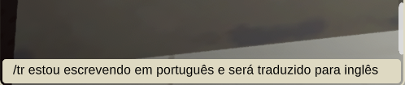
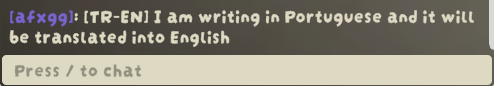

# PeakChatTranslator

[Português-BR](https://github.com/gustavogordoni/PeakChatTranslator/blob/main/README.ptbr.md) | **English**

Automatic chat translation for **PEAK** (via [PeakTextChat](https://thunderstore.io/c/peak/p/borealityy/PeakTextChat/)).

## Screenshots

### Incoming message translation
A player with **Portuguese** as native language receives an English message, with translation appearing below:

**Settings used in screenshot:**
- **General → Target Language**: `Portuguese (pt-BR)` (your native language)
- Other player writes in English → you see it translated to Portuguese automatically


### Outgoing translation (`/tr` command)
Type `/tr` followed by your message to send **only the translated version**:

**Settings used in screenshot:**
- **General → Target Language**: `Portuguese (pt-BR)` (your native language — source)
- **Outgoing → Translate My Messages To**: `English (en)` (language others receive)

| Before (you type in your language) | After (sent to chat translated) |
|-----------------------------------|----------------------------------|
|  |  |

## How it works

### Incoming messages (automatic)
- Every message from other players is automatically translated to **your** language
- Original message stays visible; translation appears below with `[TR-XX]` prefix
- Configure: **General → Target Language** = your native/preferred language

### Outgoing messages (command `/tr`)
- Type `/tr your message` → sends **only the translated version** (original is blocked)
- Source language = **General → Target Language** (your language)
- Target language = **Outgoing → Translate My Messages To** (what others receive)
- Works for any language pair supported by Google Translate/MyMemory

### Whisper translation (TinyTweaks)
- `/tr /w player message` → sends **only translated whisper** to target
- Purple formatting with `(secret msg for you)` matching TinyTweaks style

## Settings (Mod Config)
| Section | Option | Type | Default |
|---------|--------|------|---------|
| **General** | Enabled | Toggle | On |
| **General** | Target Language | Dropdown (100+ langs) | English (en) |
| **Display** | Translation Prefix | String | TR |
| **Display** | Translation Color | Hex | #7FC8FF |
| **Outgoing** | Translate My Messages To | Dropdown (100+ langs) | English (en) |

## Quick setup guide
1. **General → Target Language** = the language YOU read/write in (your native language)
2. **Outgoing → Translate My Messages To** = the language OTHERS should receive your messages in
3. Use `/tr message` to send translated messages
4. Use `/tr /w player message` for translated whispers

## Features
- **100+ languages** via Google Translate (primary) with MyMemory fallback (free, no API key)
- Automatic incoming translation + manual outgoing via `/tr`
- Whisper translation with TinyTweaks integration
- Double-translation prevention when both parties have the mod
- Asian language support: Korean, Japanese, Chinese, Russian, Arabic, Hindi, Thai, Vietnamese, etc.

## Dependencies
- [BepInExPack_PEAK](https://thunderstore.io/c/peak/p/BepInEx/BepInExPack_PEAK/)
- [PeakTextChat](https://thunderstore.io/c/peak/p/borealityy/PeakTextChat/)
- Optional: [TinyTweaks](https://thunderstore.io/c/peak/p/YonDev/TinyTweaks/) (for `/w` whispers)

## Installation
1. Install dependencies above via Thunderstore/Gale
2. Download `afxgg-PeakChatTranslator-0.2.5.zip` from Thunderstore
3. Install via Gale or extract to `BepInEx/plugins/`

## Local Build
```bash
dotnet build -c Release
# DLL at artifacts/bin/PeakChatTranslator/release/Gordoni.PeakChatTranslator.dll
# Thunderstore package at artifacts/thunderstore/release/
```

---

## Credits / AI Disclosure

> **This project was developed almost entirely with AI.**
>
> - **Tool**: [opencode](https://opencode.ai/) (software engineering CLI)
> - **Model**: Nemotron 3 Ultra Free (NVIDIA)
> - All C# code, Harmony patches, BepInEx/Photon integration, configs, ThunderPipe build/packaging, and documentation were generated/iterated via opencode prompts.
> - AI analyzed base mods (PeakTextChat, TinyTweaks) to properly integrate via public APIs and Photon events.

Human contribution: requirements review, in-game testing, UX decisions (dropdowns, commands, colors), publishing.

## License
GPLv3 — see [LICENSE](LICENSE).